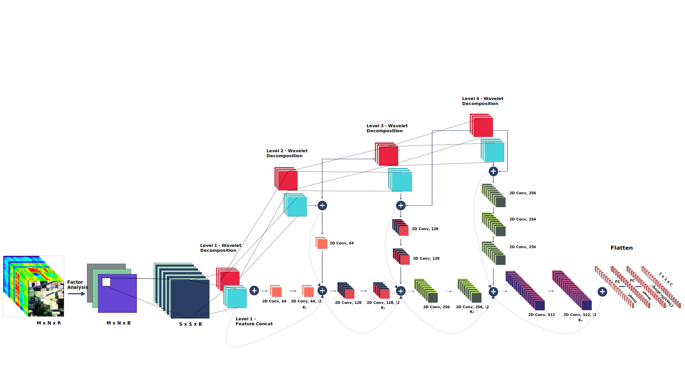

# SpectralNET a 2D wavelet CNN for Hyperspectral Image Classification.

Authors: Tanmay CHAKRABORTY & [Utkarsh TREHAN](https://github.com/UtkarshTrehan)

## Description
Hyperspectral Image (HSI) classification using Convolutional
Neural Networks (CNN) is widely found in the current
literature. Approaches vary from using SVMs to 2D CNNs,
3D CNNs, 3D-2D CNNs, FuSENets. Besides 3D-2D CNNs and
FuSENet, the other approaches do not consider both the spectral
and spatial features together for HSI classification task, thereby
resulting in poor performances. 3D CNNs are computationally
heavy and are not widely used, while 2D CNNs do not consider
multi-resolution processing of images, and only limits itself to
the spatial features. Even though 3D-2D CNNs try to model the
spectral and spatial features their performance seems limited
when applied over multiple dataset. In this article, we propose
SpectralNET, a wavelet CNN, which is a variation of 2D CNN
for multi-resolution HSI classification. A wavelet CNN uses layers
of wavelet transform to bring out spectral features. Computing
a wavelet transform is lighter than computing 3D CNN. The
spectral features extracted are then connected to the 2D CNN
which bring out the spatial features, thereby creating a spatialspectral
feature vector for classification. Overall a better model
is achieved that can classify multi-resolution HSI data with
high accuracy. Experiments performed with SpectralNET on
benchmark dataset, i.e. Indian Pines, University of Pavia, and
Salinas Scenes confirm the superiority of proposed SpectralNET
with respect to the state-of-the-art methods.

## Link to paper

http://arxiv.org/abs/2104.00341

## Model

Fig: Proposed SpectralNet (Wavelet CNN) Model for hyperspectral image (HSI) classification.

## Prerequisites

- [Anaconda 4.8.3](https://www.anaconda.com/download/#linux)
- [Tensorflow 2.3.0](https://github.com/tensorflow/tensorflow/tree/r2.4)
- [Keras 2.4.3](https://github.com/fchollet/keras)

## Results

### Salinas Scene (SS) dataset

   

Fig.4  The SA dataset classification result (Overall Accuracy 100%) of SpectralNet using 30% samples for training. (a) False color image. (b) Ground truth labels. (c) Classification map.

## Cite the paper if you are using this work
@article{chakraborty2021spectralnet,

  title={SpectralNET: Exploring Spatial-Spectral WaveletCNN for Hyperspectral Image Classification},
  
  author={Chakraborty, Tanmay and Trehan, Utkarsh},
  
  journal={arXiv preprint arXiv:2104.00341},
  
  year={2021}
  
}

## Acknowledgement
https://github.com/gokriznastic/HybridSN  
https://github.com/menon92/WaveletCNN

## License

Copyright (c) 2021 Tanmay Chakraborty and Utkarsh Trehan. Released under the MIT License. See [LICENSE](LICENSE) for details.
